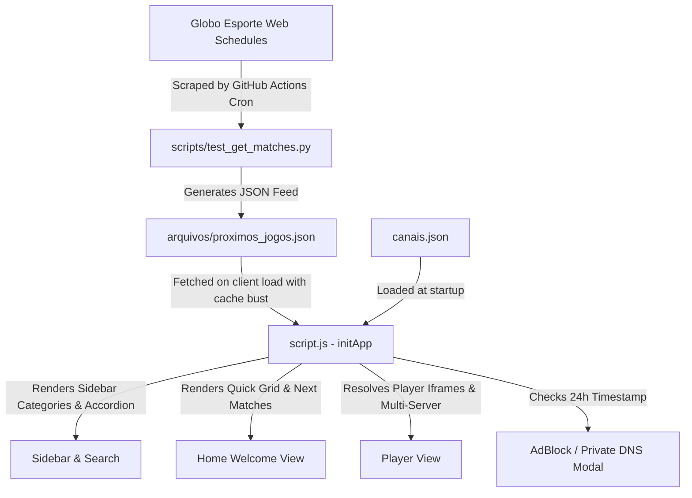

# Tvzinha Online — Master Technical & Architecture Documentation
> **Document Purpose:** Complete architectural blueprint, operational manual, and knowledge base for onboarding AI agents and human engineers to the Tvzinha project.

---

## 1. Project Overview & Mission

### 1.1 What is Tvzinha?
**Tvzinha Online** is a lightweight, responsive, high-performance web streaming interface designed to organize and stream Brazilian free-to-air television (`TV Aberta`), cable sports channels (`Esportes`), news, and entertainment. It also features a real-time Brazilian football fixture calendar integrated with live match broadcasting channels.

### 1.2 Core Principles
1. **Zero Backend Overhead:** Pure client-side static web application (HTML5, Vanilla CSS3, Vanilla ES6+ JavaScript) hosted on edge CDN (Cloudflare Pages).
2. **Streaming Aggregation (Non-Hosting):** Tvzinha does **not** store or stream video files. It embeds external third-party streaming iframes and servers.
3. **Resilience & Redundancy:** Channels offer multiple fallback servers (`Principal`, `Backup`, `Alternativo`, `EmbedTV`) so viewers can switch instantly if a source drops.
4. **Sports Hub Integration:** Automatically scrapes match schedules from *Globo Esporte* (GE) for 20 Brazilian Serie A clubs plus the Brazilian National Team, calculating real-time day countdowns and linking broadcast names directly to player channels.
5. **Living Room & TV Optimization:** Full keyboard and Smart TV D-Pad remote navigation support (compatible with LG webOS, Samsung Tizen, Android TV browsers).
6. **Viewer Protection:** Prompts viewers with AdGuard AdBlock / Private DNS instructions to prevent aggressive external player pop-ups.

---

## 2. Directory Tree & File Inventory

```
PROJETO1 - TV/
├── .agents/                          # Custom agent rules and IDE skills (Git ignored)
├── .github/
│   └── workflows/
│       └── update_matches.yml        # GitHub Actions cron (runs 2x daily to execute scraper)
├── _headers                          # Cloudflare Pages edge cache headers (no-cache for match feed)
├── .gitignore                        # Git exclusion rules
├── canais.json                       # Channel directory: categories, channel names, and stream URLs
├── index.html                        # Application single-page markup & modal templates
├── script.js                         # Monolithic application controller (state, DOM, scrapers, D-Pad)
├── style.css                         # Pure Vanilla CSS design system (Obsidian Dark mode)
├── arquivos/
│   ├── proximos_jogos.json           # Active scraped matches payload consumed by the client
│   ├── canais_nao_utilizados.json    # Reference list of inactive / standby channel URLs
│   ├── fonte.html                    # Reference scraping source / markup dump
│   └── old/                          # Deprecated legacy scripts and JSON backups
├── docs/
│   ├── PROJECT_KNOWLEDGE_BASE.md     # THIS MASTER KNOWLEDGE BASE
│   ├── DESIGN_SYSTEM.md              # UI/UX guidelines, color palette, and micro-interactions
│   ├── FEAT_ADBLOCK_NOTICE_PLAN.md   # Architectural plan for AdBlock & DNS modal notice
│   ├── FEAT_TEAM_SELECTION_PLAN.md   # Architectural plan for multi-club schedule selection
│   └── PLANNING.md                   # Legacy redesign specification
├── logos/
│   ├── fav/                          # Favicons, webmanifest, and application vector emblem
│   └── *.png, *.webp                 # Real broadcaster logos for channel list and quick-grid
└── scripts/
    └── test_get_matches.py           # Production Python scraper for GE match schedules
```

### 2.1 Git Configuration (`.gitignore`)
The repository keeps local artifacts, OS caches, and Python bytecode out of version control:
```gitignore
.agents/
.DS_Store
Thumbs.db
__pycache__/
*.pyc
```

---

## 3. Architecture & High-Level Data Flow



1. **Automation:** GitHub Actions runs `scripts/test_get_matches.py` twice daily (06:00 and 18:00 BRT).
2. **Edge Serving:** GitHub commits `arquivos/proximos_jogos.json`. Cloudflare Pages serves the file. `_headers` prevents edge caching (`no-store, must-revalidate`).
3. **Client Initialization:** `script.js` loads `canais.json` and `proximos_jogos.json` concurrently using `fetch()`.
4. **Interactive Routing:** Clicking a channel dynamically transitions the DOM from the `welcome-screen` to the `player-container`. Selecting Home returns to the welcome screen.

---

## 4. Channels & Player Subsystem

### 4.1 Data Structure (`canais.json`)
The channel database is organized hierarchically by **Category -> Channel Name -> Server Options**:
```json
{
  "TV Aberta": {
    "Globo": {
      "RJ - Principal": "https://meuplayeronlinehd.com/myplay/emb.html?id=...",
      "SP - Principal": "https://localhost70.xyz/myplay/eventos/gbplay.html?id=globosp"
    },
    "Band": {
      "Principal": "https://meuplayeronlinehd.com/myplay/emb.html?id=...",
      "SP - EmbedTV": "https://w7.embedtv.lat/bandsp"
    }
  },
  "Esportes": {
    "SporTV": {
      "Principal": "https://meuplayeronlinehd.com/myplay/emb.html?id=...",
      "Backup": "https://localhost70.xyz/myplay/premiere/primebr.html?id=sportv",
      "EmbedTV": "https://w7.embedtv.lat/sportv"
    }
  }
}
```

### 4.2 Stream Rendering & Security Sandboxing
Tvzinha isolates third-party player embeds using controlled `<iframe>` configurations:
```javascript
iframe.setAttribute("allowfullscreen", "true");
iframe.setAttribute("webkitallowfullscreen", "true");
iframe.setAttribute("mozallowfullscreen", "true");
iframe.setAttribute("allow", "autoplay; encrypted-media; picture-in-picture; fullscreen");
iframe.setAttribute("referrerpolicy", "no-referrer");
iframe.setAttribute("sandbox", "allow-forms allow-scripts allow-same-origin allow-presentation");
```
* **Why this sandbox?** It allows HTML5 playback, DRM streams, and presentation without allowing third-party scripts to trigger unauthorized top-level page navigations.

### 4.3 Redundancy & Server Switcher
When a channel has multiple feeds (e.g. `Principal`, `Backup`, `Alternativo`, `EmbedTV`):
* Buttons are generated dynamically in `.servers-grid`.
* The user can switch between servers in 1 click without reloading the application.
* Tvzinha includes an automatic loader overlay (`.video-loader-overlay`) with timeout detection and a **"Recarregar Player"** button to bust frozen stream connections.

---

## 5. Match Schedule Scraper Engine (`scripts/test_get_matches.py`)

### 5.1 Extraction Mechanism
The scraper extracts live match information from Globo Esporte without third-party dependencies (uses Python built-in `urllib` and `json`):
1. Downloads the club schedule HTML page (e.g., `https://ge.globo.com/futebol/times/flamengo/agenda-de-jogos-do-flamengo/`).
2. Locates the JSON state marker embedded in the page script: `scheduleTeam: { ... }`.
3. Performs balanced-brace JSON extraction to parse the schedule tree safely.
4. Traverses `data["teamAgenda"]["future"]` and discards past dates.
5. Normalizes championship names, team badges, stadiums, and live watch sources (`liveWatchSources`).
6. Dynamically resolves real club crests from match contestants, falling back to verified SVGs.
7. Saves up to **7 upcoming fixtures per club** into `arquivos/proximos_jogos.json`.

### 5.2 Supported Clubs & Teams (21 Entities)
| Region / Category | Clubs Included |
| :--- | :--- |
| **Rio de Janeiro** | Flamengo, Fluminense, Botafogo, Vasco |
| **São Paulo** | Corinthians, Palmeiras, São Paulo, Santos, Red Bull Bragantino |
| **Minas Gerais** | Atlético-MG, Cruzeiro |
| **Rio Grande do Sul**| Grêmio, Internacional, Juventude |
| **Paraná** | Athletico-PR |
| **Santa Catarina** | Criciúma |
| **Nordeste** | Bahia, Vitória, Fortaleza |
| **Centro-Oeste** | Cuiabá |
| **National Team** | Seleção Brasileira (`brasil`) |

### 5.3 Automated Scraper Workflow (`.github/workflows/update_matches.yml`)
* Triggered automatically via cron at **09:00 UTC (06:00 BRT)** and **21:00 UTC (18:00 BRT)**.
* Can also be triggered on-demand via `workflow_dispatch`.
* Automatically commits and pushes changes directly to `master` with `[skip ci]`.

---

## 6. Dynamic Multi-Team Match Module

### 6.1 State Management & Persistence
* Current selected team is stored in `localStorage` under `tvzinha_selected_team_id`.
* Default fallback team is `vasco`.
* If a user selects a club, it persists across sessions and device reboots.

### 6.2 Team Selection Modal
* Clicking **"Alterar time"** opens a modal displaying all 21 clubs with official SVGs.
* Includes a real-time live search filter to instantly find teams (e.g., typing "Pal" filters to Palmeiras).
* Selected club is marked with an emerald checkmark badge.

### 6.3 Next Match Intelligence (Countdown & Highlighting)
* **Featured Card:** The immediate next match is styled with the `.match-card.featured` class and an emerald top bar.
* **Smart Countdown Calculation:**
  * If the match is today: Displays `"Hoje"`.
  * If the match is tomorrow: Displays `"Amanhã"`.
  * If the match is within X days: Displays `"Em X dias"`.
  * If the date is unconfirmed: Displays `"A definir"`.
* **Visual Hierarchy:** Subsequent matches in the carousel have white/muted dates to keep focus strictly on the immediate upcoming match.
* **Championship Text:** Handled with text overflow ellipsis and full title tooltips so long names (e.g. *Copa Sul-Americana*, *Campeonato Brasileiro*) do not break the card layout.

### 6.4 Playable Broadcast Badges ("Onde Assistir")
* Scraped broadcast sources (e.g. `SporTV`, `Premiere`, `Globo`, `CazéTV`) are compared against active channel keys in `canais.json`.
* If a channel is available in Tvzinha, the badge is marked with `.broadcast-pill.playable` (emerald hover and play icon).
* Clicking the badge **directly opens that channel in the player**.

---

## 7. AdBlock & Private DNS Disclaimer Module

### 7.1 Objective & Policy
External embeds frequently insert aggressive pop-unders and redirection scripts. Tvzinha informs users that:
1. Tvzinha does not host streams and does not control external player ads.
2. Installing an AdBlock extension (AdGuard for Chrome/Edge/Firefox) blocks web pop-ups.
3. Setting up a Private DNS (`dns.adguard-dns.com`) blocks ad domains on **Mobile, Smart TVs, TV Boxes, and Fire Sticks** without installing apps.

### 7.2 Modal Behavior & 24h Expiration
* Key: `tvzinha_adblock_ack_timestamp` (stores Unix epoch in ms).
* On app launch: Checks if timestamp exists or if `Date.now() - timestamp > 24 * 60 * 60 * 1000` (24 hours).
* If expired or unacknowledged: Pops up the modal after 500ms delay.
* Clicking "Compreendi e desejo continuar" updates the timestamp and dismisses the modal.

### 7.3 Permanent UI Triggers
Users can reopen the instructions anytime using:
1. **Sidebar Filter Pills:** First pill (`#btn-sidebar-adblock`) positioned before "Todos" in the channels drawer.
2. **Desktop Home Hero:** `#btn-hero-adblock` placed prominently on the welcome screen.

---

## 8. Smart TV Remote & D-Pad Navigation Engine

### 8.1 Spatial Navigation Implementation
To ensure Tvzinha operates as a native TV app on Smart TV browsers, `script.js` implements a 2D spatial navigation algorithm (`setupTvRemoteNavigation`):
* Intercepts `ArrowUp`, `ArrowDown`, `ArrowLeft`, `ArrowRight` (and legacy TV key codes).
* Calculates Euclidean distance from the center of the active element to candidates in the intended direction.
* Applies directional weighting (`primaryDist + secondaryDist * 2.2`) to prevent erratic jumps.
* Smoothly scrolls the viewport to keep focused cards in view.

### 8.2 TV Focus Styling
* Custom outline: `2px solid var(--accent-emerald) !important`.
* Offset: `outline-offset: 3px !important`.
* Glow: `box-shadow: 0 0 16px var(--accent-emerald-glow) !important`.
* Scale: `transform: scale(1.02)`.

### 8.3 Hardware Remote Return/Back Keys
Handles physical Back buttons on remotes (`Escape`, `Backspace`, Samsung `10009`, webOS `461`, Android `4`):
1. If a modal is open: Closes the modal.
2. If mobile sidebar is open: Closes the sidebar.
3. If watching a channel: Returns immediately to Home view (`renderHomeView()`).

---

## 9. Design System & Styling Tokens (`style.css`)

### 9.1 Theme Architecture (Obsidian Dark)
Tvzinha uses a custom streaming dark mode inspired by Spotify, Kick, and premium IPTV applications:

```css
:root {
  --bg-base: #090c0b;               /* Deep obsidian background */
  --bg-surface: #0f1412;            /* Sidebar and cards */
  --bg-surface-elevated: #161e1a;   /* Popups, modals, inputs */
  --bg-surface-hover: #1c2621;      /* Interactive hover surfaces */

  --accent-emerald: #10b981;        /* Primary brand accent */
  --accent-emerald-hover: #059669;  /* Hover state */
  --accent-emerald-glow: rgba(16, 185, 129, 0.25);
  --accent-emerald-subtle: rgba(16, 185, 129, 0.08);

  --text-primary: #f0fdf4;          /* Pure light foreground */
  --text-secondary: #94a3b8;        /* Subtitles and metadata */
  --text-muted: #64748b;            /* Hints, borders, timestamps */

  --font-heading: 'Outfit', sans-serif;
  --font-body: 'Plus Jakarta Sans', sans-serif;
}
```

### 9.2 Zero Layout Shift (CLS) Rules
* Channel logos and team crests use fixed dimension wrappers (`.duel-badge-wrapper`, `.channel-logo-img-wrapper`).
* Skeleton loaders (`.skeleton-wrapper`, `.skeleton-match-card`) preserve layout during data fetches.

### 9.3 Mobile Responsive Architecture (`max-width: 768px`)
* **Header & Floating Capsule:** The floating navigation capsule (`.floating-nav-capsule`) is pinned at the top center with `top: 9px; z-index: 1100`, hiding `.mobile-brand` and `.nav-capsule-badge` on mobile to prevent overlapping the hamburger icon or adblock button.
* **Hero Banner on Mobile:** Banner uses `margin-top: 0` (no negative margins) to prevent overlapping the search bar. Hero title clearlogos are capped at `max-width: 180px; max-height: 48px;`. Carousel dots (`.movies-hero-nav`) are positioned cleanly in the top-right corner.
* **2-Column Native Movie Poster Grid:** In mobile viewports, `.movies-poster-grid` explicitly enforces `repeat(2, 1fr)` with `gap: 12px` and `100%` card width, preventing single-column card stretching and delivering a native streaming app feel (similar to Netflix/Disney+).
* **Touch Carousels:** Desktop arrow buttons (`.btn-carousel-arrow`) and row subtitle badges (`.movies-row-badge`) are hidden on touch mobile devices to eliminate visual clutter and emphasize native swipe gestures.

---

## 10. Movies On-Demand Catalog & TMDB Subsystem (Nuvio Cinema Style)

### 10.1 Concept & Architectural Decoupling
Tvzinha separates Live TV from On-Demand Movies into two dedicated views toggled via the floating top navigation capsule (`.floating-nav-capsule`):
* **`#view-tv`**: Channels accordion, multi-server TV players, and upcoming match agenda.
* **`#view-movies`**: Monochromatic cinema interface (`#080808`), spotlight search, and dynamic carousels.

### 10.2 Universal TMDB ID & Multi-Server Pipeline
Instead of manually maintaining thousands of video links or scraping pirated sites, Tvzinha fetches movie metadata from **The Movie Database (TMDB) API** and maps the global integer `tmdb_id` directly to live embed providers:
* **SuperFlix**: `https://superflixapi.quest/filme/{tmdb_id}`
* **MGEB (Dublado)**: `https://mgeb.top/embed/{tmdb_id}`
* **MyEmbed**: `https://myembed.biz/filme/{tmdb_id}`
* **VSEmbed (Multi-Áudio / Legendado)**: `https://vsembed.ru/embed/movie/{tmdb_id}?ds_lang=pob,pt,en`
* **EmbedPlay**: `https://www.embedplay.one/filme/{tmdb_id}`
* **FEmbed**: `https://fembed.lol/filme/e/{tmdb_id}`

### 10.3 12-Hour Client-Side Discovery Cache
To minimize API requests and ensure 0ms instant loading, discovery carousels (*Trending*, *Now Playing*, *Marvel*, *Anime*, *Action*) are cached in `localStorage` under `tvzinha_movies_cache_v1` with a 12-hour TTL (`12 * 60 * 60 * 1000`). If expired, fresh data is fetched in the background without blocking the UI.

### 10.4 Spotlight Search
The search bar queries TMDB in real time using a 320ms debounce (`/search/movie?query=...&language=pt-BR`). When a query is active, the discovery feed is replaced with an auto-filling grid of 2:3 movie posters.

---

## 11. LocalStorage Keys Inventory

| Key Name | Type | Description |
| :--- | :--- | :--- |
| `tvzinha_favorites` | JSON Array (strings) | List of favorited channel names |
| `tvzinha_selected_team_id` | String | Active club ID for match agenda (e.g. `'vasco'`, `'flamengo'`) |
| `tvzinha_movies_cache_v2` | JSON Object | 12-hour cached discovery feed payload for movies catalog |

### 10.3 Curated Tracks, Collections & Search Drawer
* **Curated Rows:** Populares, Lançamentos, Animações, Mestres da Direção (`FAMOUS_DIRECTORS`), Grandes Estúdios (`FAMOUS_STUDIOS`), Cinema Nacional (`with_origin_country=BR`), and Clássicos (`vote_count.gte=1000`).
* **Instant Hero Clearlogo Preloading:** Transparent PNG movie logos are pre-fetched and pre-loaded concurrently across all 5 hero spotlight movies during startup. When slides rotate or are clicked, cached PNGs swap with 0ms latency.
* **Verified Directors & Studios CDN:** 12 curated directors and 11 iconic studios use verified 200 OK CDN assets. Studio cards display sleek monochromatic white logos with crisp hover animations.
* **Dedicated Collection View (`#movies-collection-section`):** Clicking any Director or Studio navigates to an isolated, clean collection view with bio/badge and dynamic TMDB filmography without page reload.
* **Cinematic Dynamic Pagination:** Implemented in `renderPaginationControls` for both Collections (Directors/Studios) and Advanced Search/Filters. Renders total catalog count (`total_results`), current page, previous/next buttons, and numbered page pills with ellipses (`1, 2, 3 ... 8`), ensuring strict 20 items per page in the DOM for lightweight 60 FPS performance on Smart TVs.
* **Advanced Filters Drawer:** Spotlight search includes an expandable panel with Genre chips, Decade Timeline filters, and Sort criteria.

---

## 12. Operational Guide for Future AI Agents

### 12.1 Golden Rules
1. **Never hardcode external stream sources into `index.html` or `script.js`:** All channels must live strictly in `canais.json`, and movie embeds must use the `MOVIE_SERVERS` configuration array.
2. **Never break the 24-hour AdBlock logic:** Always honor the timestamp stored in `tvzinha_adblock_ack_timestamp`.
3. **Keep `test_get_matches.py` zero-dependency:** The GitHub Actions runner must execute it without needing `pip install`. Use Python standard library only (`urllib`, `json`, `datetime`, `re`).
4. **Preserve TV Navigation:** Whenever adding interactive buttons, modals, or links, ensure they are focusable (`<button>`, `<a>`, `<input>` or `tabindex="0"`) so spatial D-Pad navigation does not lose focus.
5. **Aesthetic Separation:** TV Ao Vivo uses the **Obsidian Emerald** palette; Movies catalog strictly uses the **Nuvio Monochromatic Cinema** palette (`#080808` to `#18181b` with pure white focus rings).
6. **Language Constraints:** All conversation with the user must be in **Brazilian Portuguese (PT-BR)**. All code, variables, file names, commit messages, and documentation (`.md`) must be in **English**.

